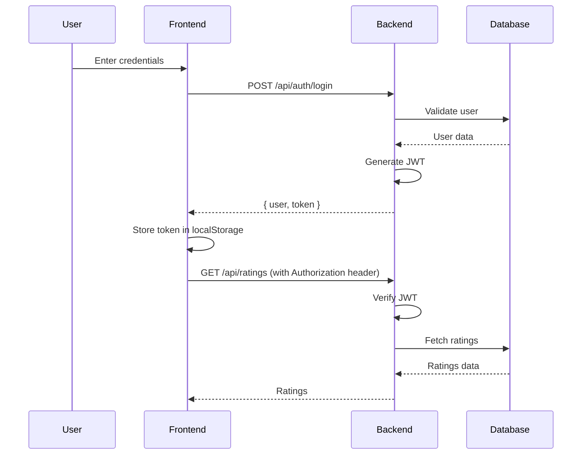
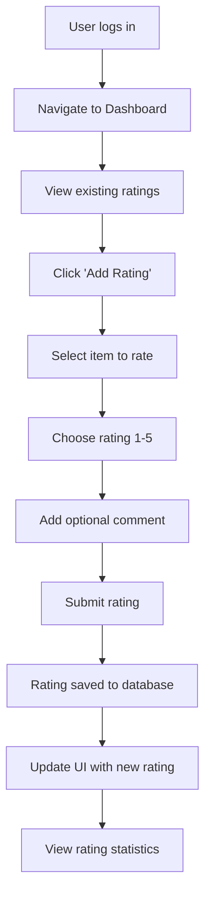
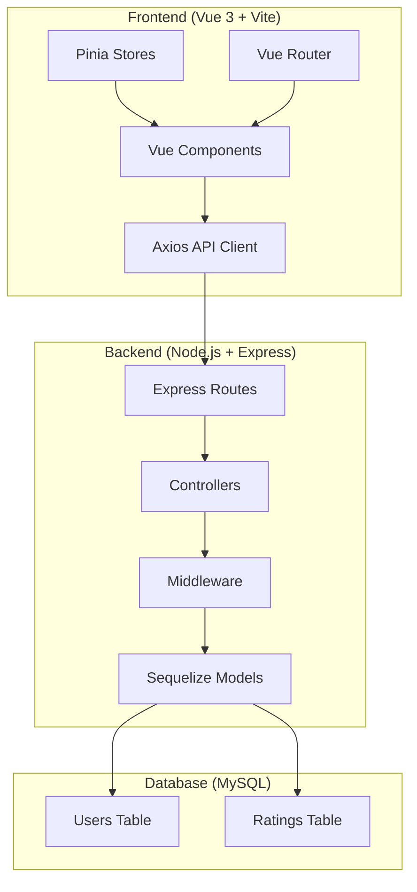

# RatingDay Web Application Architecture

## Overview

RatingDay is a web application that allows users to authenticate and manage ratings for various items. The application follows a full-stack architecture with a Vue.js frontend and a Node.js/Express backend, using MySQL as the database.

## Project Structure

```
ratingDay/
├── frontend/                 # Vue 3 frontend application
│   ├── public/              # Static assets
│   ├── src/
│   │   ├── assets/          # Images, fonts, etc.
│   │   ├── components/      # Reusable Vue components
│   │   │   ├── Auth/
│   │   │   │   ├── LoginForm.vue
│   │   │   │   ├── RegisterForm.vue
│   │   │   │   └── AuthGuard.vue
│   │   │   ├── Ratings/
│   │   │   │   ├── RatingForm.vue
│   │   │   │   ├── RatingList.vue
│   │   │   │   ├── RatingItem.vue
│   │   │   │   └── RatingStats.vue
│   │   │   ├── UI/           # DaisyUI-based components
│   │   │   │   ├── Button.vue
│   │   │   │   ├── Card.vue
│   │   │   │   └── Modal.vue
│   │   │   └── Layout/
│   │   │       ├── Header.vue
│   │   │       ├── Sidebar.vue
│   │   │       └── Footer.vue
│   │   ├── composables/     # Vue 3 Composition API utilities
│   │   │   ├── useAuth.js
│   │   │   ├── useRatings.js
│   │   │   └── useApi.js
│   │   ├── router/          # Vue Router configuration
│   │   │   └── index.js
│   │   ├── stores/          # Pinia state management
│   │   │   ├── auth.js
│   │   │   ├── ratings.js
│   │   │   └── ui.js
│   │   ├── views/           # Page-level components
│   │   │   ├── Home.vue
│   │   │   ├── Dashboard.vue
│   │   │   ├── Login.vue
│   │   │   ├── Register.vue
│   │   │   └── Profile.vue
│   │   ├── App.vue
│   │   ├── main.js
│   │   └── style.css
│   ├── package.json
│   ├── vite.config.js
│   └── tailwind.config.js
├── backend/                 # Node.js/Express backend
│   ├── src/
│   │   ├── config/          # Database and app configuration
│   │   │   ├── database.js
│   │   │   └── config.js
│   │   ├── controllers/     # Route handlers
│   │   │   ├── authController.js
│   │   │   └── ratingController.js
│   │   ├── middleware/      # Express middleware
│   │   │   ├── auth.js
│   │   │   ├── cors.js
│   │   │   └── validation.js
│   │   ├── models/          # Sequelize models
│   │   │   ├── User.js
│   │   │   ├── Rating.js
│   │   │   └── index.js
│   │   ├── routes/          # API routes
│   │   │   ├── auth.js
│   │   │   ├── ratings.js
│   │   │   └── index.js
│   │   ├── utils/           # Utility functions
│   │   │   ├── jwt.js
│   │   │   └── hash.js
│   │   └── app.js           # Express app setup
│   ├── package.json
│   ├── .env                 # Environment variables
│   └── server.js            # Server entry point
├── docs/                    # Documentation
│   └── architecture.md
├── .gitignore
└── README.md
```

## Backend Architecture

### Technology Stack

- **Runtime**: Node.js
- **Framework**: Express.js
- **ORM**: Sequelize
- **Database**: MySQL
- **Authentication**: JWT (JSON Web Tokens)
- **Password Hashing**: bcryptjs
- **CORS**: cors middleware

### Database Schema

#### Users Table

```sql
CREATE TABLE users (
  id INT AUTO_INCREMENT PRIMARY KEY,
  username VARCHAR(50) UNIQUE NOT NULL,
  email VARCHAR(100) UNIQUE NOT NULL,
  password_hash VARCHAR(255) NOT NULL,
  created_at TIMESTAMP DEFAULT CURRENT_TIMESTAMP,
  updated_at TIMESTAMP DEFAULT CURRENT_TIMESTAMP ON UPDATE CURRENT_TIMESTAMP
);
```

#### Ratings Table

```sql
CREATE TABLE ratings (
  id INT AUTO_INCREMENT PRIMARY KEY,
  user_id INT NOT NULL,
  item_id INT NOT NULL,  -- ID of the item being rated
  rating INT NOT NULL CHECK (rating >= 1 AND rating <= 5),
  comment TEXT,
  created_at TIMESTAMP DEFAULT CURRENT_TIMESTAMP,
  updated_at TIMESTAMP DEFAULT CURRENT_TIMESTAMP ON UPDATE CURRENT_TIMESTAMP,
  FOREIGN KEY (user_id) REFERENCES users(id) ON DELETE CASCADE,
  INDEX idx_user_item (user_id, item_id)
);
```

### API Endpoints

#### Authentication Endpoints

- `POST /api/auth/register` - User registration
  - Body: `{ username, email, password }`
  - Response: `{ user: { id, username, email }, token }`
- `POST /api/auth/login` - User login
  - Body: `{ email, password }`
  - Response: `{ user: { id, username, email }, token }`
- `GET /api/auth/me` - Get current user info (protected)
  - Headers: `Authorization: Bearer <token>`
  - Response: `{ user: { id, username, email } }`

#### Rating Endpoints

- `GET /api/ratings` - Get user's ratings (protected)
  - Query params: `?page=1&limit=10`
  - Response: `{ ratings: [...], total, page, limit }`
- `POST /api/ratings` - Create a new rating (protected)
  - Body: `{ item_id, rating, comment }`
  - Response: `{ rating: { id, user_id, item_id, rating, comment, created_at } }`
- `PUT /api/ratings/:id` - Update a rating (protected, owner only)
  - Body: `{ rating, comment }`
  - Response: `{ rating: { ... } }`
- `DELETE /api/ratings/:id` - Delete a rating (protected, owner only)
  - Response: `{ message: 'Rating deleted' }`
- `GET /api/ratings/stats/:item_id` - Get rating statistics for an item
  - Response: `{ item_id, average_rating, total_ratings, rating_distribution: {1: count, 2: count, ...} }`

### Authentication Flow



## Frontend Architecture

### Technology Stack

- **Framework**: Vue 3 with Composition API
- **Build Tool**: Vite
- **Styling**: Tailwind CSS + DaisyUI
- **State Management**: Pinia
- **Routing**: Vue Router
- **HTTP Client**: Axios (or fetch API)

### Component Structure

#### Page Components (Views)

- **Home.vue**: Landing page with app overview
- **Login.vue**: Login form
- **Register.vue**: Registration form
- **Dashboard.vue**: Main dashboard showing user's ratings
- **Profile.vue**: User profile management

#### Reusable Components

- **Auth Components**:
  - `LoginForm.vue`: Login form with validation
  - `RegisterForm.vue`: Registration form with validation
  - `AuthGuard.vue`: Route guard for protected pages

- **Rating Components**:
  - `RatingForm.vue`: Form to create/edit ratings
  - `RatingList.vue`: List of user's ratings
  - `RatingItem.vue`: Individual rating display
  - `RatingStats.vue`: Statistics display for items

- **UI Components**:
  - `Button.vue`: Styled button component
  - `Card.vue`: Card container
  - `Modal.vue`: Modal dialog

#### Composables

- `useAuth.js`: Authentication logic (login, logout, token management)
- `useRatings.js`: Rating CRUD operations
- `useApi.js`: Generic API call utilities

#### Stores

- `auth.js`: User authentication state
- `ratings.js`: Ratings data and operations
- `ui.js`: UI state (loading, modals, etc.)

### Rating System Functionality

#### Core Features

1. **User Authentication**: JWT-based login/registration
2. **Rating Creation**: Users can rate items on a 1-5 scale with optional comments
3. **Rating Management**: View, edit, and delete own ratings
4. **Rating Statistics**: View average ratings and distributions for items
5. **Responsive Design**: Mobile-friendly interface using Tailwind CSS and DaisyUI

#### Rating Flow



## System Architecture Diagram



## Security Considerations

- Password hashing with bcryptjs
- JWT tokens with expiration
- CORS configuration
- Input validation and sanitization
- SQL injection prevention via Sequelize ORM
- Rate limiting (to be implemented)

## Deployment Considerations

- Environment-specific configurations (.env files)
- Database migrations for schema changes
- API versioning strategy
- Static file serving for frontend build
- Reverse proxy setup (nginx) for production

## Development Workflow

1. Frontend development: `npm run dev` in frontend/
2. Backend development: `npm run dev` in backend/
3. Database setup: Run migrations and seeders
4. Testing: Unit tests for components and API endpoints
5. Build: `npm run build` for frontend production build

This architecture provides a scalable, maintainable foundation for the RatingDay application with clear separation of concerns between frontend and backend.
